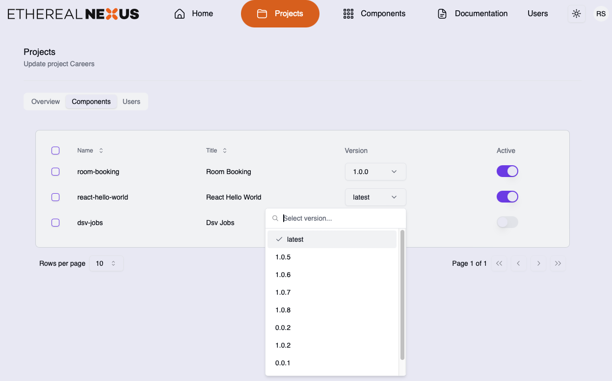

import projectsScreen from '../../../assets/screenshots/ethereal-nexus-dashboard-projects.png';
import projectDetail from '../../../assets/screenshots/ethereal-nexus-dashboard-project.png';

## Features

### Components
* Preview component in the dashboard
* Check dependants of a component
* Multiple versions of a component

### Project
* Manage the project available components
* Manager the project available component versions
* Manage user access to project

### API
* Create components with js and css binaries
* Update components
* Read component details and dialogs

## Screenshots

### Active projects

### Managing project components

