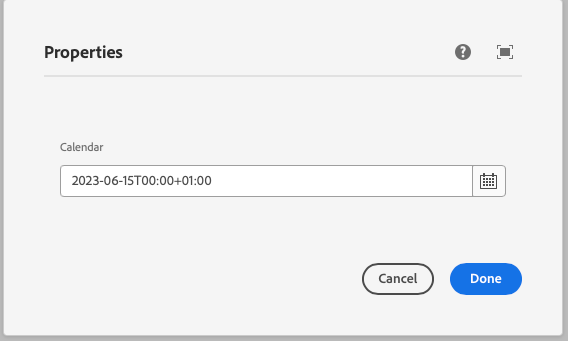
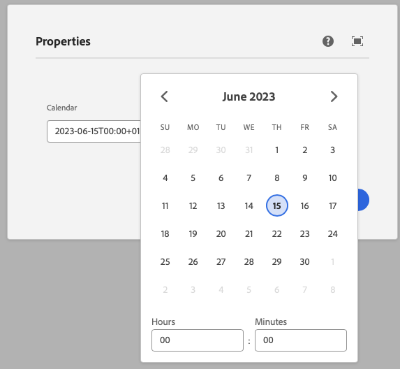

This component generates a calendar field to be used in the author dialog.
The calendar field's value is passed to the component as a prop.

### Properties

| Property                | Type     | Description                                      | Default Value  | Required |
|-------------------------|----------|--------------------------------------------------|----------------|----------|
| `label`                 | `string` | The label of the calendar component              |                | Yes      |
| `placeholder`           | `string` | Placeholder text for the calendar field          |                | No       |
| `valueformat`           | `string` | Format of the value returned by the calendar     |                | Yes      |
| `displayformat`         | `string` | Format of the date displayed in the calendar     |                | Yes      |
| `headerformat`          | `string` | Format of the header displayed in the calendar   |                | Yes      |
| `startday`              | `string` | The start day of the week                        |                | No       |
| `min`                   | `string` | Minimum date that can be selected                |                | No       |
| `max`                   | `string` | Maximum date that can be selected                |                | No       |
| `defaultValue`          | `string` | Default value for the calendar component         |                | No       |

### Example
To use a calendar component in the author dialog, we can use the following code:
```jsx
{
  calendar: calendar({
    label: 'Calendar',
    placeholder: 'Select a date',
    valueformat: 'YYYY-MM-DD',
    displayformat: 'MM/DD/YYYY',
    headerformat: 'MMMM YYYY',
    startday: '0',
    min: '2023-01-01',
    max: '2023-12-31',
    defaultValue: '2023-06-15',
  })
}
```

### Output Type

```typescript
type CalendarOutputType = string;
```

### Example in author dialog



