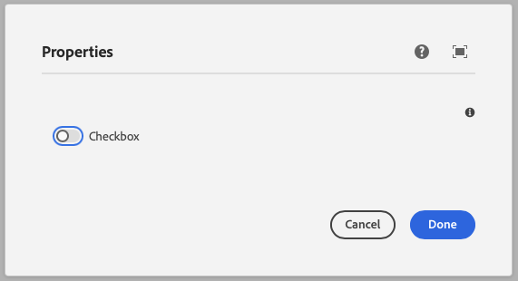

This component generates a checkbox field to be used in the author dialog.
The checkbox field's value is passed to the component as a prop.

### Properties

| Property                | Type      | Description                                      | Default Value  | Required |
|-------------------------|-----------|--------------------------------------------------|----------------|----------|
| `label`                 | `string`  | The label of the checkbox component              |                | Yes      |
| `tooltip`               | `string`  | Tooltip text for the checkbox field              |                | No       |
| `showastoggle`          | `boolean` | Whether to show the checkbox as a toggle switch  | `false`        | No       |
| `defaultValue`          | `boolean` | Default value for the checkbox component         |                | No       |

### Example
To use a checkbox component in the author dialog, we can use the following code:
```jsx
{
  checkbox: checkbox({
    label: 'Checkbox',
    tooltip: 'The checkbox of the component',
    showastoggle: true,
    defaultValue: false,
  })
}
```

### Output Type

```typescript
type CheckBoxOutputType = boolean;
```

### Example in author dialog


