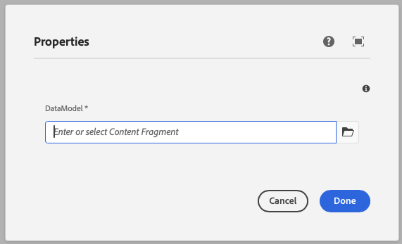

This component generates a datamodel field to be used in the author dialog.
The datamodel field's value is passed to the component as a prop.

> On AEM this will allow the author to select a content fragment.

### Properties

| Property                | Type      | Description                                      | Default Value  | Required |
|-------------------------|-----------|--------------------------------------------------|----------------|----------|
| `label`                 | `string`  | The label of the datamodel component             |                | Yes      |
| `placeholder`           | `string`  | Placeholder text for the datamodel field         |                | No       |
| `defaultValue`          | `string`  | Default value for the datamodel component        |                | No       |
| `tooltip`               | `string`  | Tooltip text for the datamodel field             |                | No       |
| `required`              | `boolean` | Whether the datamodel field is required          | `false`        | No       |

### Example
To use a datamodel component in the author dialog, we can use the following code:
```jsx
{
  datamodel: datamodel({
    label: 'DataModel',
    placeholder: 'Select a data model',
    tooltip: 'Choose a structure from the CMS',
    required: true,
  })
}
```

### Output Type

The Json of the data model is returned as a string.

```typescript
type DataModelOutputType = Record<string, any>;
```

### Example in author dialog


