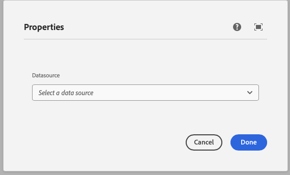

This component generates a datasource field to be used in the author dialog.
The available values are fetched from the provided URL.
The datasource field's value is passed to the component as a prop.

### Properties

| Property                | Type      | Description                                      | Default Value  | Required |
|-------------------------|-----------|--------------------------------------------------|----------------|----------|
| `label`                 | `string`  | The label of the datasource component            |                | Yes      |
| `placeholder`           | `string`  | Placeholder text for the datasource field        |                | No       |
| `defaultValue`          | `string`  | Default value for the datasource component       |                | No       |
| `url`                   | `string`  | URL to fetch the data source                     |                | Yes      |
| `multiple`              | `boolean` | Whether multiple selections are allowed          | `false`        | No       |
| `body`                  | `object`  | Body of the request                              |                | Yes      |
| `method`                | `string`  | HTTP method to use for the request               | `POST`         | No       |

### Example
To use a datasource component in the author dialog, we can use the following code:
```jsx
{
  datasource: datasource({
    label: 'Datasource',
    placeholder: 'Select a data source',
    defaultValue: 'default-source',
    url: 'https://api.example.com/data',
    multiple: false,
    body: {},
    method: 'POST',
  })
}
```

### Output Type

```typescript
type DatasourceOutputType<Multiple extends boolean> = Multiple extends true ? string[] : string;
```

### Example expected output from your service
```json
[
    {
        "value": "value1",
        "label": "Label 1"
    },
    {
        "value": "value2",
        "label": "Label 2"
    }
]
```

### Example in author dialog



