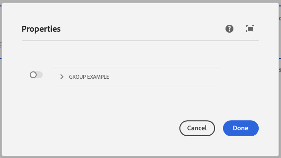
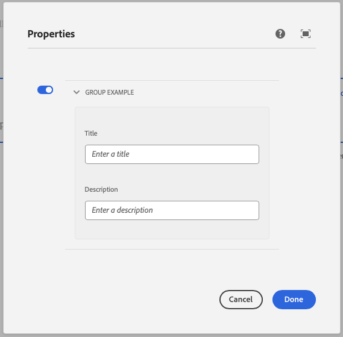

This component generates a group field to be used in the author dialog. It groups multiple fields together for better organization.
The group field's value is passed to the component as a prop object.

### Properties

| Property                | Type      | Description                                      | Default Value  | Required |
|-------------------------|-----------|--------------------------------------------------|----------------|----------|
| `label`                 | `string`  | The label of the group component                 |                | Yes      |
| `children`              | `object`  | The children item schema                         |                | Yes      |
| `tooltip`               | `string`  | Tooltip text for the group field                 |                | No       |
| `toggle`                | `boolean` | Whether to show a toggle for the group           | `false`        | No       |

### Example
To use a group component in the author dialog, we can use the following code:
```jsx
{
  group: group({
    label: 'Group Example',
    toggle: true,
    children:
      object({
        title: text({
          label: 'Title',
          placeholder: 'Enter a title',
        }),
        description: text({
          label: 'Description',
          placeholder: 'Enter a description',
        }),
      }),
  });
}
```

### Example in author dialog




