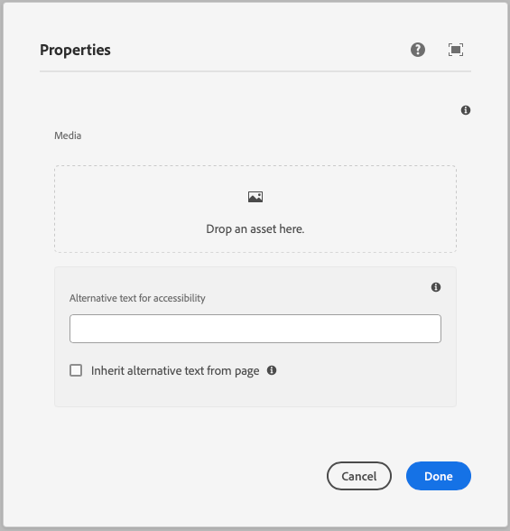

This component generates a media field to be used in the author dialog.
The media field's value is passed to the component as a prop.

### Properties

| Property                | Type     | Description                                      | Default Value  | Required |
|-------------------------|----------|--------------------------------------------------|----------------|----------|
| `label`                 | `string` | The label of the media component                 |                | Yes      |
| `tooltip`               | `string` | Tooltip text for the media field                 |                | No       |
| `defaultValue`          | `string` | Default value for the media component            |                | No       |
| `allowedMimeTypes`      | `array`  | Array of allowed MIME types for the media field  |                | No       |

### Output Type

```typescript
type MediaOutputType = {
  alt: string;
  url: string;
  renditions: string[];
};
```

### Example
To use a media component in the author dialog, we can use the following code:
```jsx
{
  media: media({
    label: 'Media',
    tooltip: 'The media of the component',
    allowedMimeTypes: ['image/jpeg', 'image/png', 'video/mp4'],
  })
}
```

### Example in author dialog


