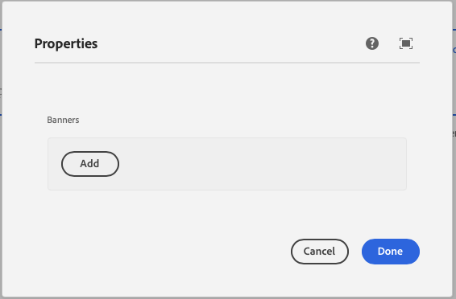
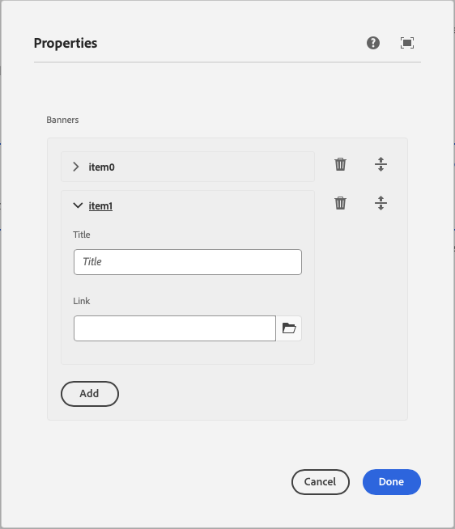

This component generates a multifield to be used in the author dialog. It allows for multiple entries of a specified field type.
The multifield's value is passed to the component as a prop.

### Properties

| Property         | Type      | Description                                      | Default Value  | Required |
|------------------|-----------|--------------------------------------------------|----------------|----------|
| `label`          | `string`  | The label of the multifield component            |                | Yes      |
| `children`       | `object`  | The children item schema                         |                | Yes      |
| `itemLabelKey`   | `string`  | Key to use for labeling each item                |                | No       |
| `tooltip`        | `string`  | Tooltip text for the multifield                  |                | No       |
| `required`       | `boolean` | Whether the multifield is required               | `false`        | No       |

### Example
To use a multifield component in the author dialog, we can use the following code:
```jsx
{
    banners: multifield({
    label: 'Banners',
    children: object({
      title: text({
        label: 'Title',
        placeholder: 'Title'
      }),
      link: pathbrowser({
        label: 'Link',
        placeholder: 'Link',
        defaultValue: "/content/default-value"
      })
    })
  })
}
```

### Example in author dialog



