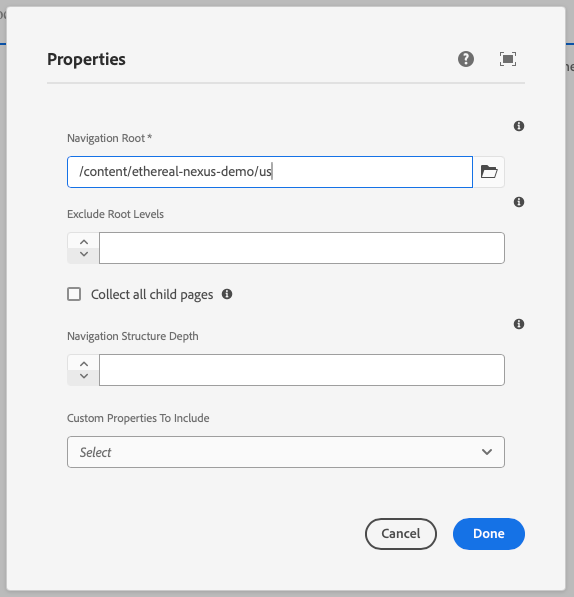

This component generates a navigation field to be used in the author dialog. It lists a tree of pages so that users of a site can easily navigate the site structure.
The navigation field's value is passed to the component as a prop.

### Properties

| Property                | Type      | Description                                      | Default Value  | Required |
|-------------------------|-----------|--------------------------------------------------|----------------|----------|
| `label`                 | `string`  | The label of the navigation component            |                | Yes      |
| `placeholder`           | `string`  | Placeholder text for the navigation field        |                | No       |
| `showChildrenCheckbox`  | `boolean` | Whether to show a checkbox for child items       | `false`        | No       |
| `showRootLevel`         | `boolean` | Whether to show the root level                   | `false`        | No       |
| `defaultValue`          | `string`  | Default value for the navigation component       |                | No       |
| `pageProperties`        | `array`   | Array of page properties                         |                | No       |
| `tooltip`               | `string`  | Tooltip text for the navigation field            |                | No       |
| `required`              | `boolean` | Whether the navigation field is required         | `false`        | No       |

### Example
To use a navigation component in the author dialog, we can use the following code:
```jsx
{
  navigation: navigation({
    label: 'Navigation Root',
    placeholder: 'Select a navigation root',
    showChildrenCheckbox: true,
    showRootLevel: true,
    pageProperties: [{
      label: "subtitle",
      value: "subtitle",
    }],
    tooltip: 'The root page from which to build the navigation. Can be a blueprint master, language master or regular page.',
    required: true,
  })
}
```

## Output Type

```typescript
export interface NavigationItemSchema {
  id: string;
  children: NavigationItemSchema[];
  active: boolean;
  url: string;
  title: string;
}
```

### Example in author dialog


