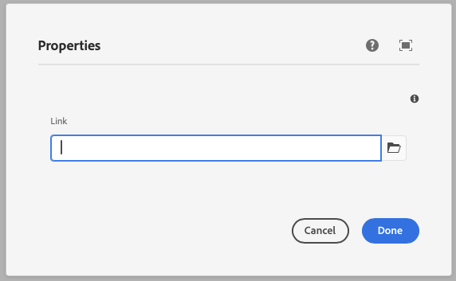
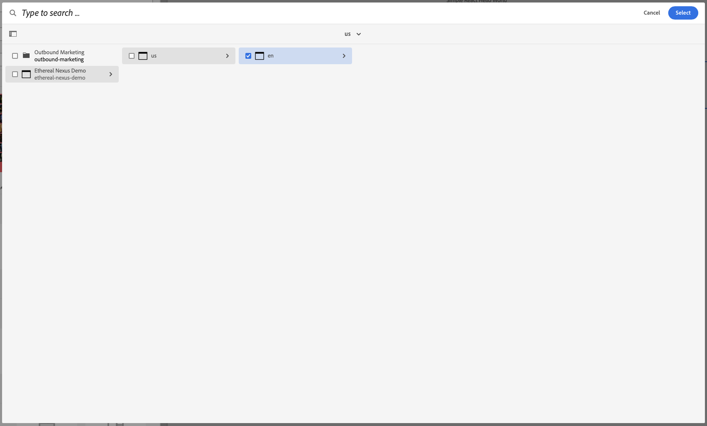

This component generates a path browser field to be used in the author dialog.
The path browser field's value is passed to the component as a prop.

### Properties

| Property                | Type     | Description                                      | Default Value  | Required |
|-------------------------|----------|--------------------------------------------------|----------------|----------|
| `label`                 | `string` | The label of the path browser component          |                | Yes      |
| `placeholder`           | `string` | Placeholder text for the path browser field      |                | Yes      |
| `tooltip`               | `string` | Tooltip text for the path browser field          |                | No       |
| `defaultValue`          | `string` | Default value for the path browser component     |                | No       |

### Example
To use a path browser component in the author dialog, we can use the following code:
```jsx
{
  link: pathbrowser({
    label: 'Link',
    placeholder: 'Select a path',
    tooltip: 'The path of the component',
    defaultValue: '/default/path',
  })
}
```

### Example in author dialog




