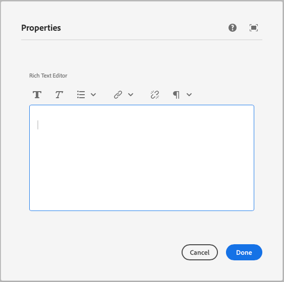

This component generates a rich text editor field to be used in the author dialog.
The rich text editor field's value is passed to the component as a prop.

### Properties

| Property                | Type      | Description                                      | Default Value  | Required |
|-------------------------|-----------|--------------------------------------------------|----------------|----------|
| `label`                 | `string`  | The label of the rich text editor component      |                | Yes      |
| `placeholder`           | `string`  | Placeholder text for the rich text editor field  |                | No       |
| `defaultValue`          | `string`  | Default value for the rich text editor component |                | No       |

### Example
To use a rich text editor component in the author dialog, we can use the following code:
```jsx
{
  rte: rte({
    label: 'Rich Text Editor',
    placeholder: 'Enter text here...',
    defaultValue: '<p>Default text</p>',
  })
}
```

### Example in author dialog


