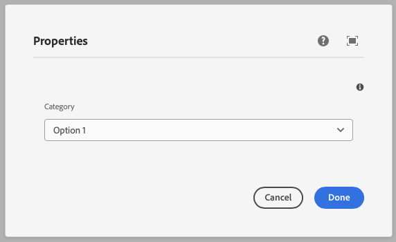
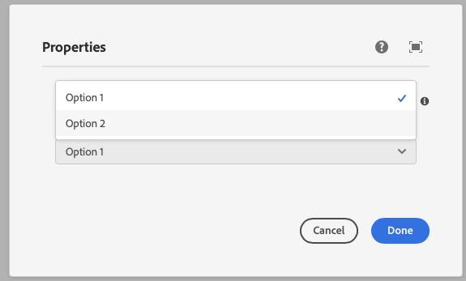

This component generates a select field to be used in the author dialog.
The select field's value is passed to the component as a prop.

### Properties

| Property                | Type     | Description                                      | Default Value  | Required |
|-------------------------|----------|--------------------------------------------------|----------------|----------|
| `label`                 | `string` | The label of the select component                |                | Yes      |
| `placeholder`           | `string` | Placeholder text for the select field            |                | No       |
| `tooltip`               | `string` | Tooltip text for the select field                |                | No       |
| `values`                | `array`  | Array of options for the select field            |                | Yes      |
| `defaultValue`          | `string` | Default value for the select component           |                | No       |
| `multiple`              | `boolean`| Allows multiple selections                       | `false`        | No       |

### Example
To use a select component in the author dialog, we can use the following code:
```jsx
{
  category: select({
    label: 'Category',
    placeholder: 'Select a category',
    tooltip: 'The category of the component',
    values: [
      { value: 'option1', label: 'Option 1' },
      { value: 'option2', label: 'Option 2' },
    ],
    defaultValue: 'option1',
    multiple: false,
  })
}
```
### Example in author dialog




