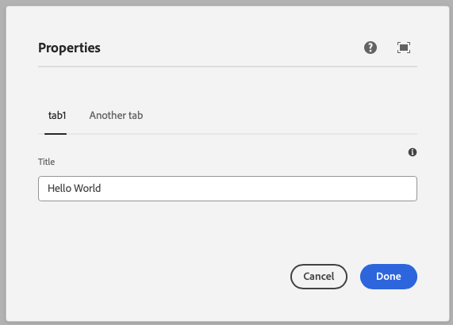
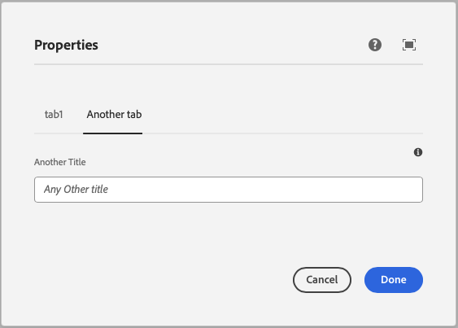

This component generates a tabs field to be used in the author dialog. It organizes content into multiple tabs for better user experience.
The tabs are only visible in the author dialog and not in the published content.

### Example
To use a tabs component in the author dialog, we can use the following code:
```jsx
const dialogSchema = dialog({
  title: text({
    label: 'Title',
    placeholder: 'Any title',
    tooltip: 'The title of the component',
  }),
  anothertext: text({
    label: 'Another Title',
    placeholder: 'Any Other title',
    tooltip: 'The title of the component',
  })
}).tabs({
  tab1: {
    title:true
  },
  'Another tab': {
    anothertext: true
  },
})
```

### Example in author dialog



