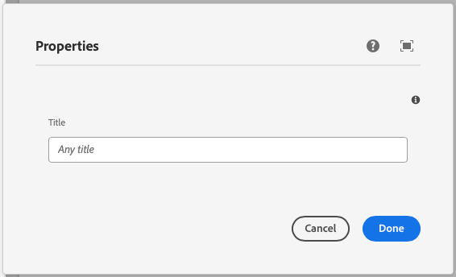

This component generates a textfield to be used in the author dialog.
The textfield's value is passed to the component as a prop.

### Properties

| Property                | Type     | Description                                      | Default Value  | Required |
|-------------------------|----------|--------------------------------------------------|----------------|----------|
| `label`                 | `string` | The label of the text component                  |                | Yes      |
| `placeholder`           | `string` | Placeholder text for the input field             | `Any title`    | No       |
| `tooltip`               | `string` | Tooltip text for the input field                 |                | No       |
| `defaultValue`          | `string` | Default value for the text component             | `Hello World`  | No       |
| `validationRegex`       | `string` | Regular expression for validation                | `^Hello World$`| No       |
| `validationErrorMessage`| `string` | Error message displayed when validation fails    | The text must be "Hello World" | No |


### Example
To use a text component in the author dialog, we can use the following code:
```jsx
{
  title: text({
    label: 'Title',
    placeholder: 'Any title',
    tooltip: 'The title of the component',
    defaultValue: 'Hello World',
    validationRegex: '^Hello World$',
    validationErrorMessage: 'The text must be "Hello World"',
  })
}
```

### Example in author dialog


